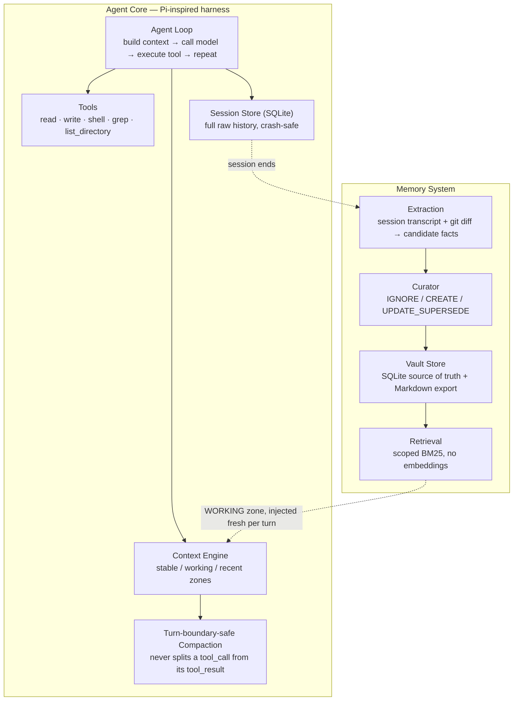

# Persistent Coding Agent with Learned Memory


A coding agent, built from scratch in TypeScript, with a memory system that decides what's worth remembering instead of remembering everything.

> **Thesis:** an agent shouldn't accumulate every fact it's ever seen. It should preserve the information that actually improves future decisions — and whether that's true should be *measured* against a no-memory baseline, not just claimed.

---

## What this is

Most "AI agent has memory" projects fall into one of two camps: static and manual (a `CLAUDE.md`-style file you edit by hand), or fully emergent (the agent decides on its own, with no evaluation of whether that's actually helping). This project is neither — it's a **deterministic, gradable memory pipeline**: every fact goes through explicit extraction, a curator that makes one of three auditable decisions, and scoped lexical retrieval — no embeddings, no vector DB, no graph engine, by design, until a real evaluation proves that's actually necessary.

The agent harness itself is Pi-inspired (not a fork — an independent implementation of the same core loop shape: build context → call model → execute tools → repeat), verified against Pi's own real source where it mattered (e.g. confirming Pi has no dedicated git tool either, and that its compaction logic never cuts mid-tool-call the same way this one doesn't).

## Current status

| Phase | What it covers | Status |
|---|---|---|
| **A — Harness** | Agent loop, tools, sessions, context engine, compaction | ✅ Complete, proven live |
| **B — Memory** | Schema, vault, extraction, curator, retrieval | ✅ Complete, proven live across separate processes |
| **C — Intelligence** | Dogfooding, decision logging, fine-tuned curator | 🚧 In progress |
| **D — Evaluation** | Formal benchmark vs. no-memory / static / naive-transcript baselines | ⏳ Not started |

Nothing below is aspirational — every item marked complete has been exercised against a real repo, not just a synthetic test script.

---

## Architecture



Memory injection is deliberately one-directional and non-persistent: retrieved memories are spliced into the model-facing context on every turn but are **never** written back into session history — a stale memory snapshot baked permanently into a transcript would just be noise on every future replay.

### Where state actually lives

Session and memory state are stored **outside** whatever project you point the agent at — never inside the repo being worked on. This is a structural decision, not a convenience one: a general-purpose file-exploring agent will eventually stumble onto anything sitting inside the directory it's told to explore, so the only real fix is to not put it there. (Verified this is exactly how real coding agents handle it — Claude Code stores its own session data under `~/.claude/projects/<path>/`, never inside your repo.)

```
~/.coding-agent/projects/<sanitized-project-path>/
├── project.json        — which real directory this belongs to
├── sessions.db          — full raw conversation history, every turn
├── memories.db           — the actual memory: structured, temporal, curated facts
└── vault/knowledge/
    └── <scope>.md          — human-readable export (for you to read, not the agent)
```

---

## Features

**Harness**
- A real generalized agent loop — not a fixed exchange, keeps calling/executing/feeding-back until the model ends its turn or a safety cap is hit
- Cache-aware context engine (stable / working / recent zones) built for provider-side prompt caching
- Turn-boundary-safe compaction — summarizes older history without ever orphaning a tool result from its tool call
- Retry-with-backoff on transient failures, parsing the provider's own retry timing when available
- Full interrupt support — Ctrl+C cancels the current turn cleanly, not the whole process
- Output truncation at the source, so one oversized tool result can never blow the entire context budget on its own
- Session persistence that survives crashes and live rate-limit failures mid-task

**Memory**
- Temporal memory records — facts have a `validFrom`, can be superseded (not deleted), full history recoverable
- A curator with an auditable 3-class decision space: `IGNORE`, `CREATE`, `UPDATE_SUPERSEDE`
- Hand-rolled BM25 retrieval, scoped before ranked, with a real Porter-style stemmer (verified against realistic vocabulary, not just its own test case)
- Extraction grounded in the session's actual git diff, not just the model's self-reported account of what it did
- Strict JSON-schema validation on every LLM-produced decision — a malformed extraction fails loudly, not silently, before it can corrupt the vault

---

## What's actually been proven (not just built)

This project's development discipline has been: ship the minimal version, run it for real, fix what actually breaks. A sample of what that's surfaced:

- A brand-new OS process — zero shared memory, a different session entirely — correctly recalling a fact about the project (a cache backend migration) from a prior, separate session, on disk only
- A live contradiction test: a fact stated in one session, contradicted in a second, correctly synthesized by the curator into an updated fact — with the original still recoverable, not deleted
- A real 413 "request too large" failure traced through three compounding causes (an unhandled empty-string path argument, a cross-platform shell command mismatch, and an unbounded directory listing) and fixed at the actual source
- A live vault-bypass bug — the model discovered it could "remember" something by writing a file directly into its own memory vault using general-purpose file tools, invisibly skipping the entire curated pipeline — diagnosed and fixed structurally, the same way production agents solve it, rather than patched with a tool-level restriction that a model could just route around via the shell

---

## Tech stack

- **Runtime:** Node.js (LTS), TypeScript in `strict` mode
- **LLM provider:** Groq (multi-provider harness pattern designed for OpenRouter/Gemini expansion)
- **Persistence:** SQLite (`better-sqlite3`) for session and memory metadata, plain Markdown for the human-readable vault export
- **Retrieval:** hand-rolled BM25 — no vector DB, no embeddings, by deliberate v1 scope

## Getting started

```bash
# install
npm install

# set your provider key
echo "GROQ_API_KEY=your-key-here" > .env

# run
npx tsx src/cli/main.ts
```

Inside the CLI:

```
/new [label]     start a new session
/sessions        list all sessions
/resume <id>     resume a session by id (or a unique prefix)
/help            show commands
/exit            quit — memory extraction runs automatically
```

## Project structure

```
src/
  core/
    loop.ts              — the agent loop
    provider.ts           — LLM provider interface
    providers/groq.ts
    retry.ts               — backoff + abort handling
    agent-paths.ts          — resolves the external, per-project state directory
  context/
    builder.ts             — token estimation, context budget
    compaction.ts            — turn-boundary-safe compaction
  tools/
    read.ts  edit.ts  shell.ts  grep.ts  list-directory.ts
    truncate.ts             — output size cap, shared across tools
    path-utils.ts            — protected-path guard
  sessions/
    store.ts                — SQLite session persistence
    run-session.ts
  memory/
    schema.ts                — MemoryRecord, Episode, CuratorDecision
    vault-store.ts             — SQLite source of truth + Markdown export
    extraction.ts               — transcript + git diff → candidate memories
    curator.ts                   — IGNORE / CREATE / UPDATE_SUPERSEDE
    process-episode.ts            — curation pipeline glue
    retrieval.ts                   — scoped BM25
    git-diff.ts
    format-context.ts               — injects retrieval into the WORKING zone
    finalize-session.ts              — session-end memory pipeline entrypoint
  cli/
    main.ts
```

---

## Roadmap

**Now — Phase C.** Real dogfooding across multiple projects (deliberately different languages and conventions), logging every curator decision as a real input/output training pair, then fine-tuning a small model (Qwen2.5-Coder, SFT-only) to replace the prompted curator for that one narrow task — and comparing the two head-to-head on held-out examples, rather than assuming the smaller model is as good.

**Next — Phase D.** A real evaluation: 20-25 hand-written multi-session tasks spanning architectural continuity, failed-approach memory, temporal fact updates, and deliberately noisy "distraction" memory — benchmarked against no-memory, naive-full-transcript, and static-markdown baselines. The goal is an honest result, including where memory *doesn't* help — that's what makes this an engineering finding rather than a demo.

**Explicitly out of scope for v1** — and written down as a decision, not an oversight: embeddings, vector DB, graph memory, GRPO/preference optimization, procedural "skill" promotion, adaptive retrieval. If dogfooding demonstrates one of these is actually necessary, that becomes a documented finding first, and a v2 feature second — not a mid-project scope change.

## Acknowledgments

The harness design is inspired by [Pi](https://github.com/earendil-works/pi) — its core loop shape, tool philosophy, and compaction safety invariant are the reference points this project checked itself against throughout. The memory system's design was shaped in conversation with [Letta](https://github.com/letta-ai/letta)'s memory architecture, deliberately diverging from it in places (SQLite as source of truth rather than a git-backed Markdown filesystem) where that fit this project's goals better.
